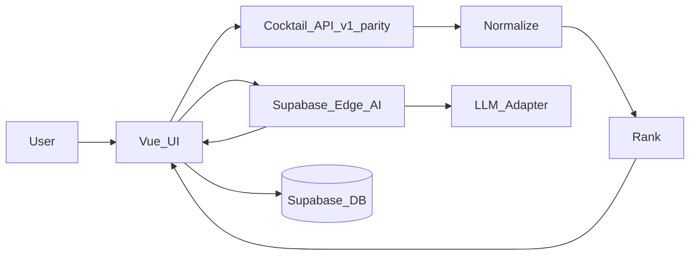
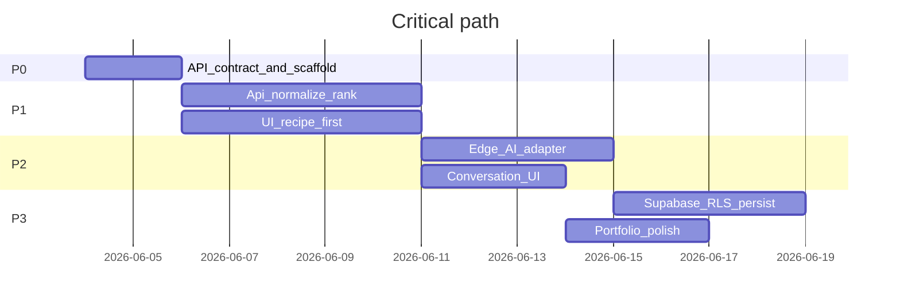

# Full build plan: Cocktail Shaker 2

**Status:** Phase 1 complete — Phase 2 next  
**Last updated:** 2026-06-04  

Companion docs: [architecture.md](architecture.md), [prd.md](prd.md), [mvp.md](mvp.md), [persona.md](persona.md), [prompt-spec.md](prompt-spec.md), [task-breakdown.md](task-breakdown.md).

---

## Overview

End-to-end build plan for Cocktail Shaker 2: Vue 3 + Supabase successor with **original-API parity** (Phase 0 gate), **app-side ranking as source of truth**, **provider-agnostic AI hostess** via Edge Function, and phased delivery through portfolio-ready MVP.

---

## Implementation checklist

- [x] **Phase 0:** Document original app API contract (`docs/api-contract.md`) + Vue/Vite/TS scaffold, lint, test, env
- [x] **Phase 1:** cocktailApi client, normalization, substitutions, ranking engine + Vitest; Pinia cabinet/session
- [x] **Phase 1 UI:** Cabinet input, style filters, ranked results, recipe card, loading/empty/error states
- [ ] **Phase 2:** Supabase Edge `recommend` function, provider-agnostic LLM adapter, schema validation + fallback
- [ ] **Phase 2 UI:** Conversation panel, refinement chips, re-rank loop, degraded non-AI mode
- [ ] **Phase 3:** Supabase migrations, RLS policies, optional auth, cabinet/favourites/preferences sync
- [ ] **Phase 3:** Mobile polish, README, `docs/evolution.md`, screenshots, CI/deploy pipeline

---

## What we are building

A **portfolio successor** to the original Cocktail Shaker: ingredient-led discovery stays factual via the **same external cocktail API as v1**; the app owns **normalize → rank → select**; the LLM only **presents and refines** candidates already scored ([architecture.md](architecture.md), [prd.md](prd.md)).



**Grill verdict:** If ranking or recipe cards ever depend on the model, the product fails the PRD. AI outages must still yield a usable ranked list + recipe card.

---

## Locked decisions

| Decision | Choice | Rationale |
|----------|--------|-----------|
| Cocktail data | **Parity with original app API** | Verified: TheCocktailDB **v2** + Patreon key — [`docs/api-contract.md`](docs/api-contract.md) |
| LLM | **Provider-agnostic adapter** (env selects OpenAI / Anthropic / etc.) | Keeps portfolio deploy flexible |
| Auth in MVP | **No sign-in required** for core flows | Cabinet via `localStorage` first; Supabase + optional magic-link auth in Phase 3 |
| Hostess UI | **Text-led** (no avatar v1) | Reduces scope and uncanny-valley risk |
| Candidates to AI | **Top 5 ranked** in payload; **UI shows 1 primary + up to 2 alternatives** | Prevents list-like UX; matches [persona.md](persona.md) |
| Repo state | **Docs only** — greenfield app scaffold is Phase 0 work | See [task-breakdown.md](task-breakdown.md) |

**Original app:** [github.com/PaulWheatcroft/theCocktailShaker](https://github.com/PaulWheatcroft/theCocktailShaker) — API contract in [`docs/api-contract.md`](docs/api-contract.md).

---

## Explicit non-goals (do not slip into MVP)

- Social, marketplace, occasion mode, taste memory, sharable links, "buy next bottle" ([mvp.md](mvp.md) later list)
- LLM inventing ingredients, measures, or history ([prompt-spec.md](prompt-spec.md))
- Replacing or modifying the original portfolio app ([prd.md](prd.md))
- Full cocktail ontology / every edge case ([prd.md](prd.md) non-goals)
- Heavy component library skin — **tailored design tokens** per [architecture.md](architecture.md)

---

## Target repository layout

```text
cocktail-shaker-2/
  docs/                    # optional: api-contract.md, evolution.md
  supabase/
    migrations/
    functions/
      recommend/           # AI orchestration
  src/
    app/                   # main.ts, router, global styles
    components/ui/         # primitives (Button, Chip, Card)
    features/
      cabinet/
      cocktails/
      conversation/
      preferences/
    services/
      cocktailApi/         # v1-parity client
      normalization/
      ranking/
      substitutions/
    stores/                # Pinia
    types/
    pages/
  tests/
    unit/                  # ranking, normalization, parsing
  .env.example
  README.md
  BUILD_PLAN.md            # this file
```

---

## Phase 0: Foundation and API contract (1–2 days)

**Deliverables**

- Vue 3 + TypeScript + Vite scaffold (`create-vue` or equivalent minimal template)
- Pinia, Vue Router (routes: `Home`, optional `Preferences`)
- ESLint + Prettier + Vitest + `@vue/test-utils`
- Env strategy: `VITE_SUPABASE_URL`, `VITE_SUPABASE_ANON_KEY`; **no LLM keys in client**
- **API contract artifact** (`docs/api-contract.md`): transcribed from original app — endpoints, types, error behavior
- Typed stub in `src/services/cocktailApi/` matching contract (can mock until contract verified)
- Design direction doc snippet in README: typography, dark/refined palette, mobile-first

**Exit criteria**

- `npm run dev`, `npm run test`, `npm run build` all green
- Contract doc reviewed: every field needed for `Cocktail` in [architecture.md](architecture.md) mapped to **source field or derivation rule**

**Grill checks**

- If original calls API from browser with public key → replicate; if server-side proxy → use Supabase Edge **proxy function** (do not expose secrets)
- If v1 uses ingredient filter that returns duplicates/noise → document dedupe strategy in contract

---

## Phase 1: Functional core without AI (4–7 days)

Build the **trust layer** first — this is what makes the hostess credible later.

### 1.1 Cocktail API service (v1 parity)

- `src/services/cocktailApi/client.ts` — fetch wrappers per contract
- `src/services/cocktailApi/types.raw.ts` — raw API types
- Ingredient search: v1 uses `filter.php?i=a,b` for two ingredients; single ingredient otherwise; **max 2** per filter call
- Error taxonomy: network, 404 empty, malformed payload → user-facing copy in UI

### 1.2 Normalization layer

- `src/services/normalization/toCocktail.ts` maps raw → internal `Cocktail`
- `src/services/normalization/ingredients.ts` — canonical names (trim, lowercase, alias map)
- Derive `tags`, `baseSpirit`, `style[]` via **rules table** (JSON or TS map), not LLM
- Log/normalize **unknown or missing** API fields; never fabricate measures

### 1.3 Substitution model (basic)

- `src/services/substitutions/rules.json` — curated pairs: `acceptable` | `tolerable` | `regrettable`
- Used only in ranking + hostess payload notes, not to change API facts

### 1.4 Ranking engine (pure, tested)

- `src/services/ranking/score.ts` — weighted formula from [architecture.md](architecture.md):
  - `ingredientCoverage` (0.4)
  - `styleMatch` (0.25)
  - `housePreference` (0.2)
  - `substitutionConfidence` (0.15)
- `src/services/ranking/rankCandidates.ts` — sort, top N, attach `reasons[]` for AI payload
- **Vitest suite** with fixtures

### 1.5 Pinia stores (client-only persistence)

- `cabinetStore` — `localStorage`
- `sessionStore` — selected cocktail, ranked list, style filters, last user request
- No Supabase yet

### 1.6 UI (recipe-first, no chat dependency)

| Surface | Responsibility |
|---------|----------------|
| `CabinetInput` | chips + free text, autocomplete |
| `StyleFilters` | dry / bitter / citrusy / classic |
| `RankedResults` | top 3; primary highlighted |
| `RecipeCard` | **only from normalized model** |
| States | loading, empty cabinet, API error, zero matches |

**Exit criteria**

- User enters cabinet → ranked cocktails + recipe card **without AI**
- Unit tests cover ranking edge cases

**Grill checks**

- Recipe card and rank order **identical** before/after AI phase
- Empty API results: helpful copy, not fake cocktails

---

## Phase 2: AI hostess layer (3–5 days)

### 2.1 Supabase Edge Function: `recommend`

- Input per [architecture.md](architecture.md) + [prompt-spec.md](prompt-spec.md)
- System prompt from [prompt-spec.md](prompt-spec.md) + [persona.md](persona.md)
- Structured JSON output: `verdict`, `primaryRecommendation`, `rationale`, `alternatives[]`, `followUpSuggestions[]`
- Provider adapter: `LlmClient.completeStructured` — OpenAI / Anthropic via `LLM_PROVIDER` secret
- Validate `primaryRecommendation` ∈ `topCandidates`; retry once, then deterministic fallback

### 2.2 Client integration

- `src/services/ai/recommend.ts` → Edge Function
- `ConversationPanel` + refinement chips
- Refinement: re-rank in app → new AI call with updated top 5
- **Degraded mode:** ranked #1 + static template if AI fails

### 2.3 Guardrails

- Top 5 candidates only to LLM; normalized summary only
- Timeout + fallback; no full conversation history in v1 LLM context

**Exit criteria**

- [mvp.md](mvp.md) must-haves for AI + refinement
- Manual eval per [prompt-spec.md](prompt-spec.md) checklist (~10 cabinets)
- AI never changes recipe card ingredients

---

## Phase 3: Persistence, polish, portfolio (4–6 days)

### 3.1 Supabase schema + RLS

Tables: `profiles`, `cabinet_items`, `favourite_cocktails`, `saved_preferences`, `conversation_sessions`, `conversation_messages`.

- RLS on all tables; `auth.uid() = user_id`; no `user_metadata` in policies
- Anonymous: `localStorage`; optional magic link + merge cabinet on login

### 3.2–3.4 Preferences, UX polish, portfolio

- README, screenshots, `docs/evolution.md`, favourites, mobile polish

**Exit criteria:** [mvp.md](mvp.md) success test (cabinet → personality + trusted recipe in under one minute).

---

## Phase 4: Hardening and ops (2–3 days)

- GitHub Actions: lint, vitest, vue-tsc, build
- Deploy FE + Supabase; Edge secrets; `.env.example`
- CORS, no service role in client, secret scan in CI

---

## Data and type contracts

`src/types/domain.ts`: `Cocktail`, `RankedCandidate`, `HostessRequest`, `HostessResponse`, `SubstitutionNote`, `StyleTag`.

Types in code are authoritative; [architecture.md](architecture.md) JSON is reference.

---

## Testing strategy

| Layer | Tool | Focus |
|-------|------|--------|
| Normalization | Vitest | messy API → stable `Cocktail` |
| Ranking | Vitest | ordering, style, substitutions |
| AI payload | Vitest | composer safety |
| Edge function | Deno / script | schema + fallback |
| E2E (optional) | Playwright | cabinet → rank → card; mock AI in CI |

Avoid trivial “component renders” tests; prioritize ranking, normalization, AI contract.

---

## Risk register

| Risk | Mitigation |
|------|------------|
| Original API undocumented | Phase 0 gate; no Phase 1 without `docs/api-contract.md` |
| API noise/duplicates | Dedupe by id; minimum coverage threshold |
| LLM drift off candidates | Post-validate recommendation; fallback template |
| Slow multi-ingredient fetch | Batch, cache in Pinia, progressive loading |
| Persona fatigue | Prompt cap on wit; clarity wins per [persona.md](persona.md) |
| Supabase scope creep | Local-first until Phase 3 |
| Looks like ChatGPT wrapper | README + evolution doc; demo shows recipe source |

---

## Critical path (Gantt)



---

## Prerequisites before implementation

1. **Original Cocktail Shaker repo or API contract** (URLs, sample responses, auth).
2. **Supabase project** (new or existing).
3. **Deploy targets** (e.g. Vercel + Supabase hosted).
4. **Portfolio URLs** for original app and your site.

---

## Definition of done (whole MVP)

- [ ] Ingredient cabinet in → ranked cocktails out using **v1-parity API**
- [ ] Recipe card 100% from normalized API data
- [ ] Hostess on **top 5 only**, structured response + chips
- [ ] Refinement re-ranks in app, then re-invokes hostess
- [ ] AI failure → ranked fallback still usable
- [ ] Cabinet + favourites persist (local; cloud if signed in)
- [ ] README + evolution note + screenshots for portfolio
- [ ] CI green; secrets not in repo
